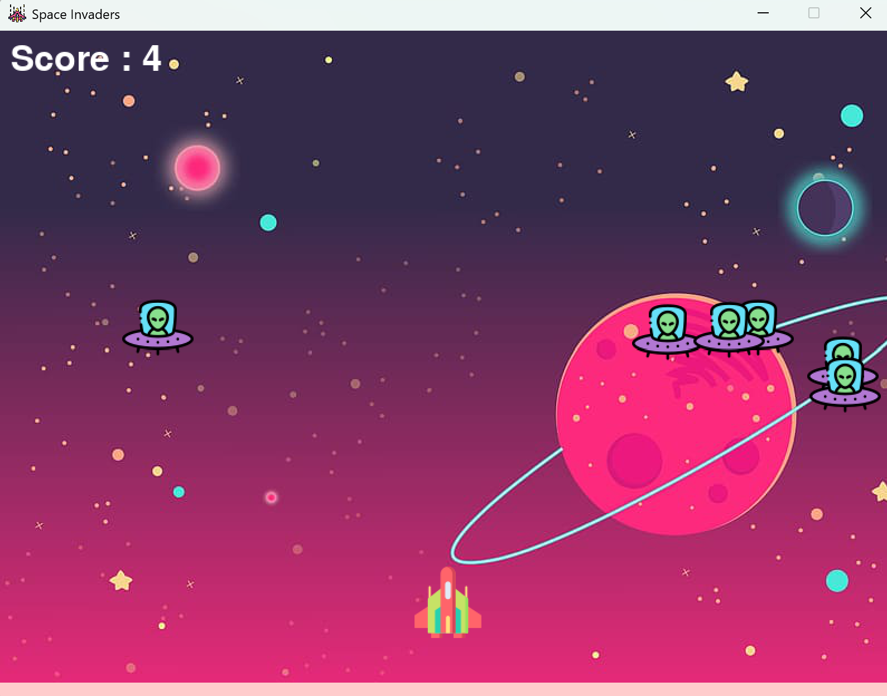
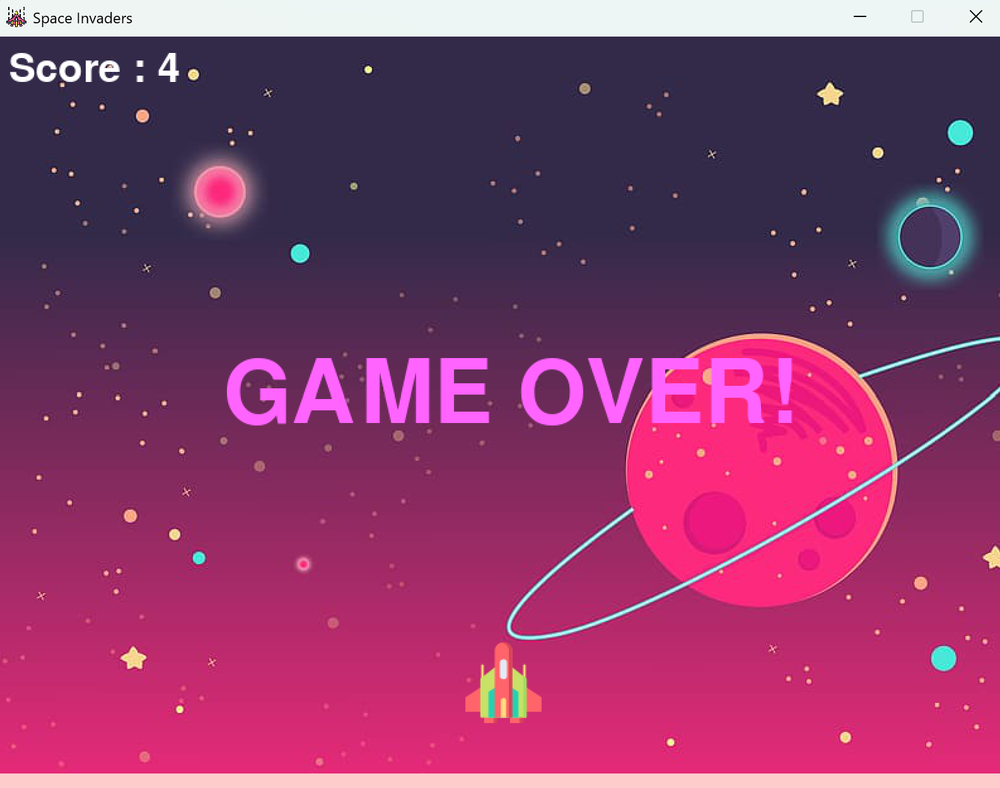

# 🚀 Space Invaders - Pygame Project

A classic-style arcade game built using Python and Pygame. 
In this game, the player controls a spaceship that can shoot bullets to destroy incoming enemy ships.
The game includes background music, sound effects and a scoring system.

---

## 🎮 Features

- Player-controlled spaceship
- Multiple enemy ships with movement
- Shooting mechanics with bullet states
- Collision detection
- Scoring system
- Game Over screen
- Background music and sound effects

---

## 📸 Screenshots of Gameplay
<div align="center">
  
  
</div>


---

## 🛠️ Requirements

- Python 3.x
- [Pygame](https://www.pygame.org/) library

Install Pygame with:

```bash
pip install pygame
```

Open your terminal and run the following command to clone the repository from GitLab:

```git clone git@github.com:jade211/Space-Invaders-Python.git```

Run the game using:
``` python3 main.py```
